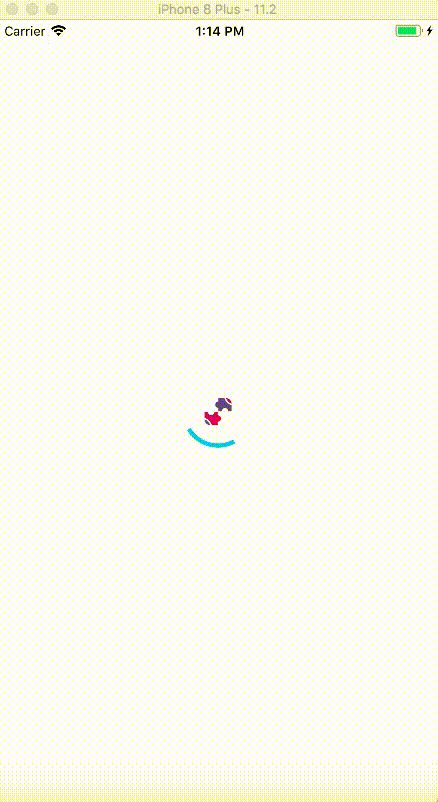
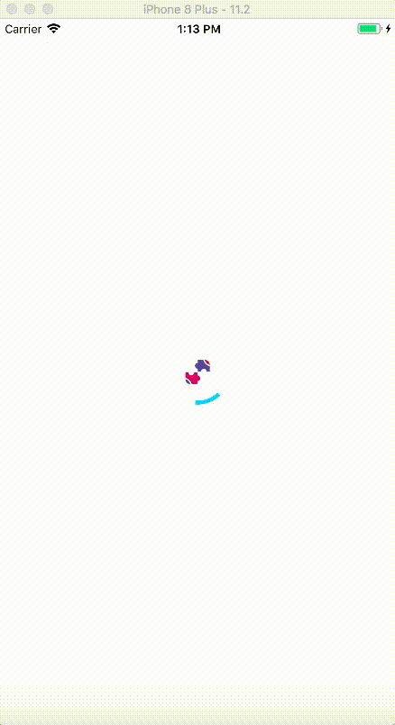
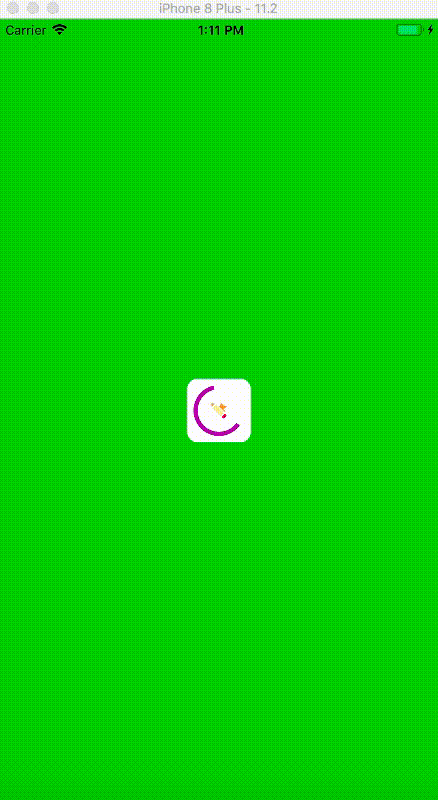

# ABAnimateProgressView

A customized progressView which is a subclass of UIView for managing progress.

  

## Requirements

iOS 9.0 and above
Swift 3

### Installation
Just Drag and Drop ABAnimateProgressView.swift in your project and set the images which to be used for ABAnimateProgressView.

### Usage

To show the ProgressView

        progressView.show()

To hide the ProgressView

        progressView.hide()

### Customisations

        progressView.imgLogoArray = [UIImage(named:"2-menu")!,
                                         UIImage(named:"1-menu")!,
                                         UIImage(named:"3-menu")!]
        progressView.animateColor = [#colorLiteral(red: 0, green: 0.9914394021, blue: 1, alpha: 1),
                  #colorLiteral(red: 0.5568627715, green: 0.3529411852, blue: 0.9686274529, alpha: 1), 
                  #colorLiteral(red: 0.8078431487, green: 0.02745098062, blue: 0.3333333433, alpha: 1)]
        
        progressView.duration = 2.0
        progressView.lineWidth = 4.0
        progressView.widthProgressView = 80.0
        progressView.bgColor =  UIColor.clear
        progressView.logoBgColor = UIColor.clear
        
        
 ### Author
For any queries and suggestions reach out at bathamankur001@gmail.com
